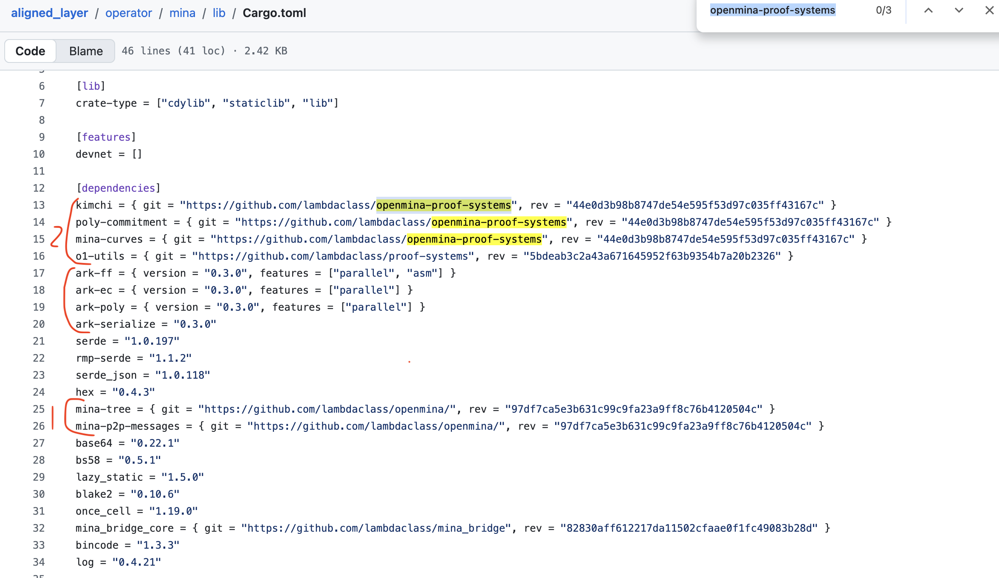
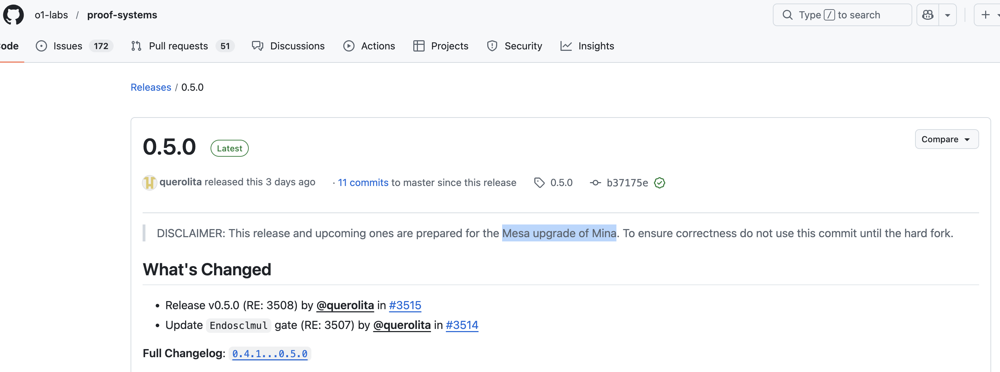

# Nori — AlignedLayer × Mina Mesa Analysis

## Executive Summary

AlignedLayer's current support for Mina (Berkeley) required only minor, peripheral code changes. Based on the analysis below, supporting Mina (Mesa) is expected to follow the same pattern — the required changes will be small and isolated.

---

## Methodology

The analysis is based on the [mina-state-verifier](https://github.com/yetanotherco/aligned_layer/blob/staging/operator/mina) crate from AlignedLayer's `staging` branch (the [mina-account](https://github.com/yetanotherco/aligned_layer/tree/staging/operator/mina_account/lib) crate is equivalent). The focus is on the delta between AlignedLayer's current dependencies and the upstream `o1-labs/mina-rust` and `o1-labs/proof-systems` repositories.

**Reference:** [AlignedLayer staging — Cargo.toml](https://github.com/yetanotherco/aligned_layer/blob/staging/operator/mina/lib/Cargo.toml)

---

## Dependency Analysis

### 1. `mina-tree` / `mina-p2p-messages`

These crates depend on the [`lambdaclass/openmina` — `mina_bridge` branch](https://github.com/lambdaclass/openmina/tree/mina_bridge), which is a fork of `lambdaclass/openmina/main`.

The diff between `main` and `mina_bridge` is minimal — primarily version bumps in `Cargo.toml` and small adjustments to function signatures. See the [full comparison here](https://github.com/lambdaclass/openmina/compare/main...lambdaclass:openmina:mina_bridge).

This gives us confidence that **AlignedLayer's changes on top of `mina-rust` for Mesa support will also be small and peripheral.**

Note that `lambdaclass/openmina/main` tracks `o1-labs/mina-rust` as its upstream.

> **Open question:** Does `o1-labs/mina-rust` already support the Mesa hard fork?
> A question has been submitted upstream — no response yet.
>
> *Side note:* As of the time of writing, neither the release tags nor any branch of `o1-labs/mina-rust` appear to include Mesa HF support. For example:
> - [tag-0.19.0](https://github.com/o1-labs/mina-rust/blob/ed6f4301d594d7db066ae71cbcd7f9e34f6e02a1/Cargo.toml#L140) pins `o1-labs/proof-systems` at [tag-0.2.0](https://github.com/o1-labs/proof-systems/releases/tag/0.2.0)
> - [develop](https://github.com/o1-labs/mina-rust/blob/ab69eaed85fc71859fedbb2c36b2030294084a82/Cargo.toml#L142) branch pins `o1-labs/proof-systems` at [tag-0.3.0](https://github.com/o1-labs/proof-systems/releases/tag/0.3.0)
> - But `o1-labs/proof-systems`'s support on Mesa HF only begins at [tag-0.5.0](https://github.com/o1-labs/proof-systems/releases/tag/0.5.0) (see below)

---

### 2. `kimchi` / `poly-commitment` / `mina-curves` dependencies

These crates depend on [`lambdaclass/openmina-proof-systems` @ `44e0d3b9`](https://github.com/lambdaclass/openmina-proof-systems/commit/44e0d3b98b8747de54e595f53d97c035ff43167c), whose upstream is `o1-labs/proof-systems`.

As noted above, Mesa HF support in `o1-labs/proof-systems` begins at `tag-0.5.0`.

A diff between `44e0d3b9` and `o1-labs/proof-systems@0.5.0` reveals that **all customizations are confined to the `signer/` module and its downstream call sites** — 7 files in total (see [unique-commits-diff.md](./unique-commits-diff.md)). The changes fall into three categories:

1. **`signer` module additions** — `from_bytes`, `to_hex`, `secret_multiply_with_curve_point`, `Signature::dummy`, `PartialOrd`/`Ord` and custom `Debug` for `CompressedPubKey`
2. **`kimchi` prover refactor** — `rng` parameter moved from internal hardcode to explicit caller argument
3. **Test / call-site adapters** — updated to match the new function signatures

This confirms that **AlignedLayer's changes on top of `proof-systems` for Mesa support will also be small and peripheral.**

---

### 3. `o1-utils`

The same conclusion applies — the delta is minimal.

---

## Conclusion

Supporting Mina (Mesa HF) in AlignedLayer is **blocked on upstream stabilization**: both `o1-labs/mina-rust` and `o1-labs/proof-systems` need to ship stable Mesa-compatible releases before AlignedLayer can integrate them.

However, based on the pattern observed across all three dependency layers, the **engineering effort on the AlignedLayer side is expected to remain small** — incremental, peripheral changes rather than a significant re-architecture.
